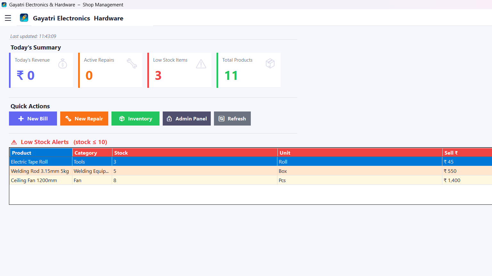
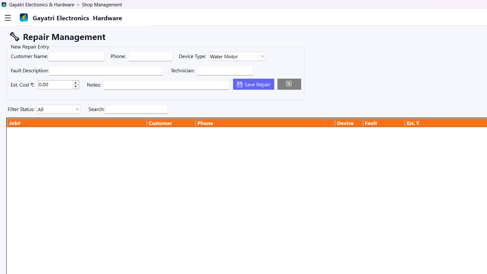
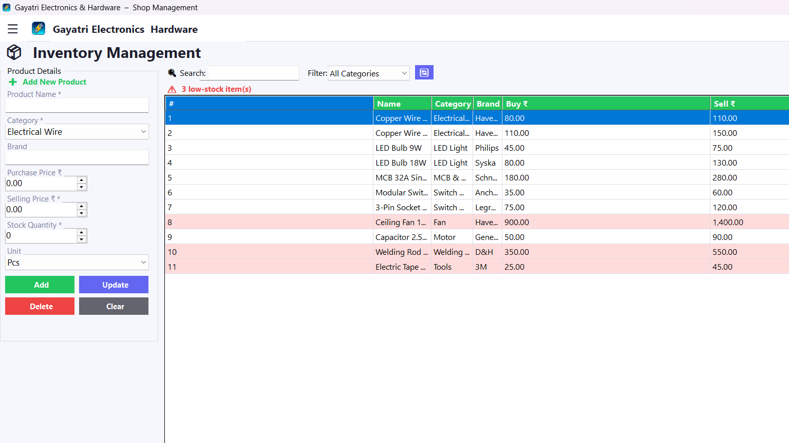

<div align="center">


# 🏪 Gayatri Electronics & Hardware
### Shop Management Desktop Application

[](https://dotnet.microsoft.com/)
[](https://learn.microsoft.com/en-us/dotnet/desktop/winforms/)
[](https://github.com/ClosedXML/ClosedXML)
[](LICENSE)

*A complete, portable, offline Shop Management System for electronics and electrical hardware shops.*

</div>

---

## 📸 Screenshots

| Dashboard | Billing | Inventory |
|-----------|---------|-----------|
|  |  |  |

---

## ✨ Features

### 📊 Dashboard
- Live stats: Today's Revenue, Active Repairs, Low Stock Alerts, Total Products
- Quick action buttons to jump to any module
- Auto-refreshes every time you navigate back

### 🧾 Billing / Sales
- Product dropdown with all inventory items
- **Custom / Other items** — add any item not in inventory (labour charges, misc parts)
- Auto quantity merge for duplicate products
- Discount support
- Print receipt (GDI+ based, no printer driver needed)
- Saves to Excel Sales sheet automatically

### 🔧 Repairs
- Track repairs with device type, fault description, technician, cost
- Status tracking: Pending → In Progress → Completed
- Full repair history with search and filter

### 📦 Inventory Management
- Add, Edit, Delete products
- Category and brand filtering
- Low-stock alert (highlights items with stock ≤ 10)
- Real-time search across name, brand, category

### 🔐 Admin Panel
- Secure login (default: `admin` / `1234`)
- View all sales and repair records
- Change admin password
- Full data overview

---

## 🗂️ Project Architecture

```
ShopManagementApp/
│
├── ShopManagementApp.UI/            ← WinForms UI layer
│   ├── Forms/
│   │   ├── MainForm.cs              ← SPA shell with sidebar navigation
│   │   ├── DashboardForm.cs
│   │   ├── BillingForm.cs
│   │   ├── RepairForm.cs
│   │   ├── InventoryForm.cs
│   │   ├── AdminPanelForm.cs
│   │   └── AdminLoginForm.cs
│   └── Assets/
│       ├── AppIcon.ico              ← App icon (EXE + taskbar)
│       └── AppIcon.png              ← Logo in top bar
│
├── ShopManagementApp.Business/      ← Business logic layer
│   └── Services/
│       ├── BillingService.cs
│       ├── RepairService.cs
│       └── InventoryService.cs
│
├── ShopManagementApp.Data/          ← Data access layer
│   ├── Excel/
│   │   └── ExcelManager.cs          ← Auto-create + schema versioning
│   └── Repositories/
│       ├── ProductRepository.cs
│       ├── SalesRepository.cs
│       └── RepairRepository.cs
│
├── ShopManagementApp.Models/        ← Data models
│   ├── Product.cs
│   ├── Sale.cs
│   ├── SaleItem.cs
│   └── Repair.cs
│
└── ShopManagementApp.Utils/         ← Shared utilities
    ├── Constants.cs
    ├── ValidationHelper.cs
    └── PrintHelper.cs
```

---

## 🗃️ Excel Database (Auto-Managed)

The app uses **ClosedXML** to manage a local `ShopData.xlsx` file.

| Sheet | Purpose |
|-------|---------|
| `Products` | All inventory items |
| `Sales` | Bill headers |
| `SaleItems` | Individual line items per bill |
| `Repairs` | Repair job records |
| `Settings` | Admin credentials + schema version |

> ✅ **The Excel file is created automatically on first run** — no manual setup needed.
> ✅ **Schema versioning** — if the file format changes, the app backs up old data and creates a fresh file.

---

## 🚀 Getting Started

### Prerequisites
- Windows 10 / 11
- [.NET 8 SDK](https://dotnet.microsoft.com/download/dotnet/8.0) (for development)
- Visual Studio 2022 or VS Code

### Run from Source

```bash
# Clone the repository
git clone https://github.com/YOUR_USERNAME/ShopManagementApp.git
cd ShopManagementApp

# Restore NuGet packages
dotnet restore

# Run the application
dotnet run --project ShopManagementApp.UI
```

### Build Portable EXE (No Installation Needed)

```bash
dotnet publish ShopManagementApp.UI\ShopManagementApp.UI.csproj --configuration Release --runtime win-x64 --self-contained true -p:PublishSingleFile=true --output ".\Publish\GayatriElectronics"
```

The output folder contains a single `GayatriElectronics.exe` (~198 MB) that runs on **any Windows 10/11 PC** without installing .NET.

---

## 🔐 Default Admin Credentials

| Field | Value |
|-------|-------|
| Username | `admin` |
| Password | `1234` |

> ⚠️ Change the password after first login via **Admin Panel → Change Password**.

---

## 🛠️ Tech Stack

| Technology | Purpose |
|-----------|---------|
| C# .NET 8 | Core language |
| WinForms | Desktop UI framework |
| ClosedXML | Excel read/write |
| GDI+ | Receipt printing |
| System.Drawing | Icon & image handling |

---

## 📦 NuGet Packages

```xml
<PackageReference Include="ClosedXML" Version="0.102.2" />
```

---

## 🏗️ Key Design Decisions

- **SPA Navigation** — All pages load inside a single `_pageHost` panel. No popup windows, no header overlap.
- **Double Buffering** — `SmoothPanel` class + `WS_EX_COMPOSITED` flag eliminates all flicker during page switching.
- **Schema Versioning** — `ExcelManager` checks a `SchemaVersion` key on startup. Stale schemas trigger auto-backup + fresh file creation.
- **Custom Billing Items** — `ProductId = 0` bypasses stock deduction for non-inventory items (labour charges, misc).
- **Portable Build** — Single self-contained EXE bundles the entire .NET runtime.

---

## 📄 License

This project is licensed under the MIT License — see the [LICENSE](LICENSE) file for details.

---

<div align="center">

Made with ❤️ for **Gayatri Electronics & Hardware**

</div>
